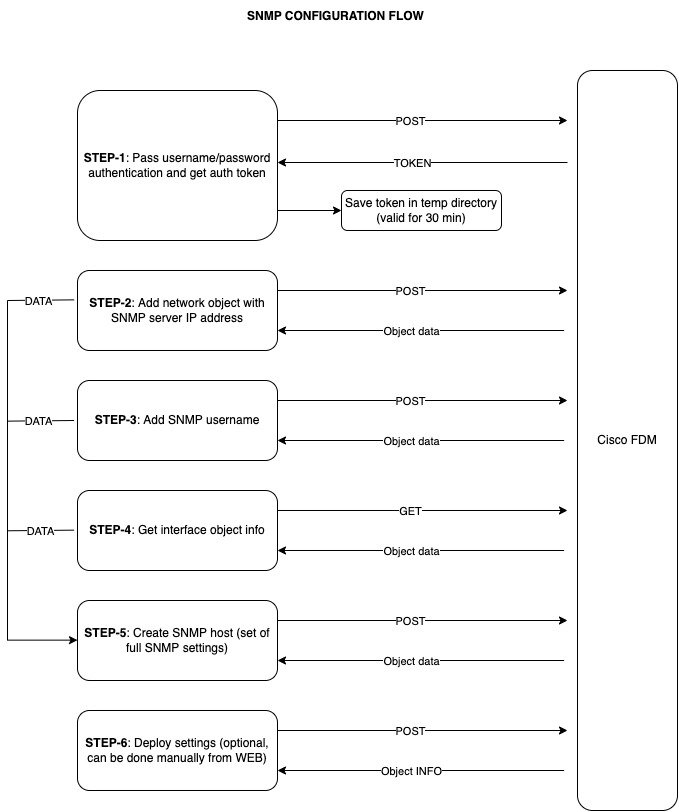

## Scripts for Cisco FDM configuration using API

### Description
Python script allows users to fill in paramaters with ASA FDM creds, parameters and got it provisioned automatically.

### Release notes
1.1.1 Script works with one IP only<br/>
1.1.2 Docker container is added

### This git direcory contains:
1. Python code
2. Requirements file
3. API diagrams

## Usage options
### 1. Run Python scripts on Linux
1. Make new venv
```
python3 -m venv ~/.api_env
source ~/.api_env/bin/activate
```
2. Install packets
```
python -m pip install --upgrade pip
pip install -r requirements.txt
```
3. Check templates (optional)
```
cd templates
ls
```
4. Read help
```
python snmp_config_fdm.py --help
```
5. Script usage (for example, SNMP configuration)
```
python snmp_config_fdm.py \
  --fdm_ip 10.1.1.1 \
  --username admin \
  --password 'XXX' \
  --snmp_server_ip 10.2.2.2 \
  --snmp_user SNMP-USER \
  --snmp_host_name SNMP-HOST \
  --auth_key XXX \
  --encr_key XXX \
  --interface_name inside
```
### 2. Run Docker container
Build container (optional)
```
docker build . -t mbps54/python-api-cisco:1.1.1
```

Run container
```
docker run -it \
           -e FDM_IP='1.1.1.1' \
           -e USERNAME='admin' \
           -e PASSWORD='passwword' \
           -e SNMP_SERVER_IP='1.1.1.1' \
           -e SNMP_USER='snmpUser' \
           -e SNMP_HOST_NAME='snmpHost' \
           -e AUTH_KEY='XXXXXX' \
           -e ENCR_KEY='YYYYYY' \
           -e INTERFACE_NAME='LAN' \
           -e DEPLOY='False' \
           -e FDM_PORT='443' \
           -e API_VERSION='6' \
           --name cont-python-api-cisco \
           mbps54/python-api-cisco:1.1.1
```

### 3a. Run Jenkins free style job (Python)
Not ready yet, in backlog for future

### 3b. Run Jenkins free style job (Docker)
Not ready yet, in backlog for future

## API messages diagrams
### SNMP configuration


### Repo info
```
tree

├── api_fdm
│   ├── functions
│   │   ├── basic_functions.py
│   │   ├── fdm_get.py
│   │   ├── fdm_login.py
│   │   ├── fdm_post.py
│   │   ├── initial_auth.py
│   │   └── requests_functions.py
│   ├── readme.md
│   ├── snmp_config_fdm.py
│   ├── templates
│   │   ├── object_networks.txt
│   │   ├── object_snmphosts.txt
│   │   └── object_snmpusers.txt
│   └── tmp
│       ├── debug.log
│       └── token
├── diagram
│   └── SNMP.pdf
└── requirements.txt
```
